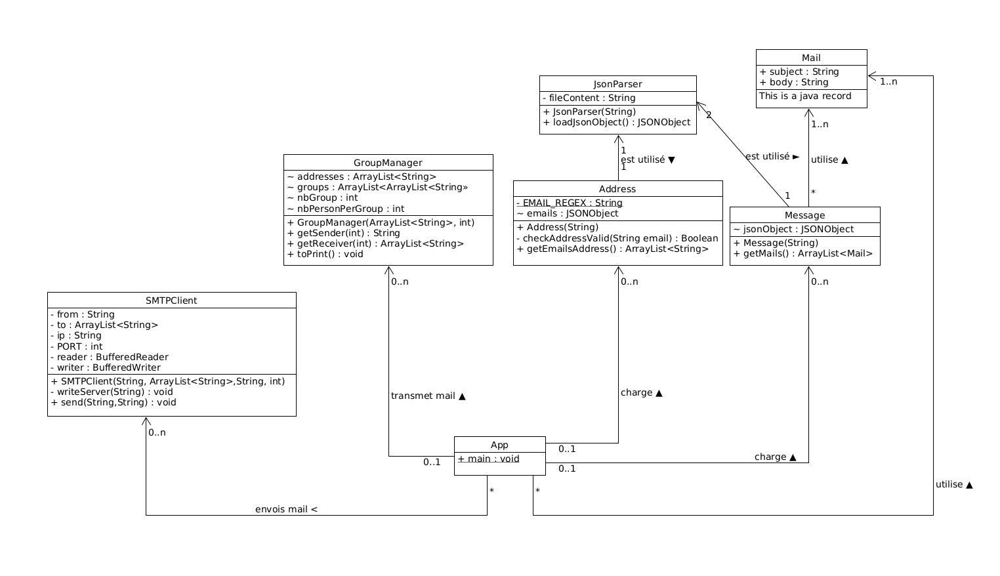

## Introduction

## Serveur Mock

Pour lancer le serveur mock nous utilisons MailDev qui est un serveur de test smtp

Pour le lancer vous pouvez utiliser docker en lancant la commande suivante

```bash
docker run -d -p 1080:1080 -p 1025:1025 maildev/maildev
```

## Fonctionnement 

### JsonParser

Json parser une la classe qui va nous permettre de wrapper la librairie org.JSON de maven pour pouvoir l'utiliser plus simplement. Cette classe consiste juste a lire le fichier json et le parser et retourner l'objet parsé qui sera utilisé dans les autres classe

### Addresse

Cette classe permet de parser le contenu du fichier de configuration pour repertorier les addresses mail. Il utilise la classe JSONParser pour parser le fichier puis retourne un tableau contenant toute les addresses mail

### Message

Cette classe permet de passer l'autre fichier de configuration. Celui des messages des mails "blague". Il renvoie aussi un tableau de record Mail qui contiennent eux meme l'objet et le body du mail.

### GroupManager

Cette classe permet de créer les groupes d'envoi et de recuperer les differents acteur des groupes. On peut demander a recuperer l'addresse de l'envoyeur et on peut aussi demander a recuperer toutes les addresses des receveur

### SMTPClient

La classe SMTPClient est une implémentation en Java d'un client SMTP (Simple Mail Transfer Protocol), qui permet d'envoyer des courriers électroniques en utilisant le protocole SMTP via un serveur. Voici une explication détaillée de son fonctionnement :

#### Attributs de la Classe:
Ces derniers sont initialisé à travers le constructeur de la classe. Sauf reader et writer qui sont instancier lorsqu'on commence à envoyer des messages.

  from: Représente l'adresse e-mail de l'expéditeur.
  to: Une liste d'adresses e-mail des destinataires.
  ip: L'adresse IP du serveur SMTP.
  PORT: Le numéro de port utilisé pour la communication avec le serveur SMTP.
  reader: Un objet BufferedReader pour lire les données provenant du serveur.
  writer: Un objet BufferedWriter pour écrire des données vers le serveur.

#### Méthodes:
writeServer(String texte): Méthode privée permettant d'écrire du texte vers le serveur SMTP en respectant le format requis par le protocole.
send(String subject, String message): Méthode publique permettant d'envoyer un courrier électronique. Elle établit une connexion avec le serveur SMTP, envoie les commandes SMTP appropriées, encode le sujet en Base64 pour prendre en charge l'UTF-8, puis envoie le contenu du courrier électronique.

#### Communication SMTP:
La méthode send effectue les étapes nécessaires conformément au protocole SMTP pour envoyer un courrier électronique. Ces étapes incluent l'établissement d'une connexion avec le serveur SMTP, l'envoi des commandes EHLO, MAIL FROM, RCPT TO, DATA, etc., et la fermeture de la connexion à la fin du processus.

#### Encodage Base64:
Le sujet du courrier électronique est encodé en Base64 avant d'être envoyé. Cela est fait pour assurer la compatibilité avec le jeu de caractères UTF-8.

#### Gestion des Exceptions:
La classe capture les exceptions d'E/S (IOException) et affiche un message générique si une erreur se produit lors de la communication avec le serveur SMTP.


En résumé, cette classe permet d'automatiser l'envoi de courriers électroniques en utilisant le protocole SMTP. Elle peut être utilisée en fournissant les informations nécessaires, telles que l'expéditeur, les destinataires, le serveur SMTP, et le port, puis en appelant la méthode send avec le sujet et le contenu du courrier électronique à envoyer.

### Config

## Configuration et utilisation

Pour utiliser notre application on peut configurer 3 choses
- La pool d'addresse mail
- Les messages qu'on peut envoyé
- Le nombre de groupe créé

### Pool d'addresse mail

Pour ajouter ou supprimer des addresses il faut editer le fichier `/resources/email.json` qui suit la structure suivante
```json
{
  "adresses_emails": [
    "addresse1@addresse.com",
    "addresse2@addresse.com",
  ]
}

```
Vous pouvez rajouter autant d'addresse mail que vous le voulez

> [!WARNING]  
> Toutes vos addresses doivent etre valide. Sinon elles ne seront pas comptée

### Message

Pour configurer des nouveaux message respecter la structure json suivante
```json
{
  "emails": [
    {
      "subject": "Réunion d'équipe",
      "body": "Chers collègues,\n\nNous aurons une réunion d'équipe demain à 10h dans la salle de conférence. Merci de préparer vos mises à jour et vos questions.\n\nCordialement,\n[Votre Nom]"
    }
  ]
}

```
On peut ajouter plusieurs objets dans le tableau emails qui doit contenir un subject et un body.

### Nombre de groups

Le nombre de groupe peut etre passé en ligne de commande en appelant le programme

## Utilisation

La commande doit s'effectué au niveau du pom.xml et permet de lancer l'envois de mail

```bash
mvn compile exec:java -Dexec.mainClass="com.dai.App" -Dexec.args=""CHEMIN_VERS_MAIL" "CHEMIN_VERS_MESSAGE" NB_GROUPE"
```

## UML


